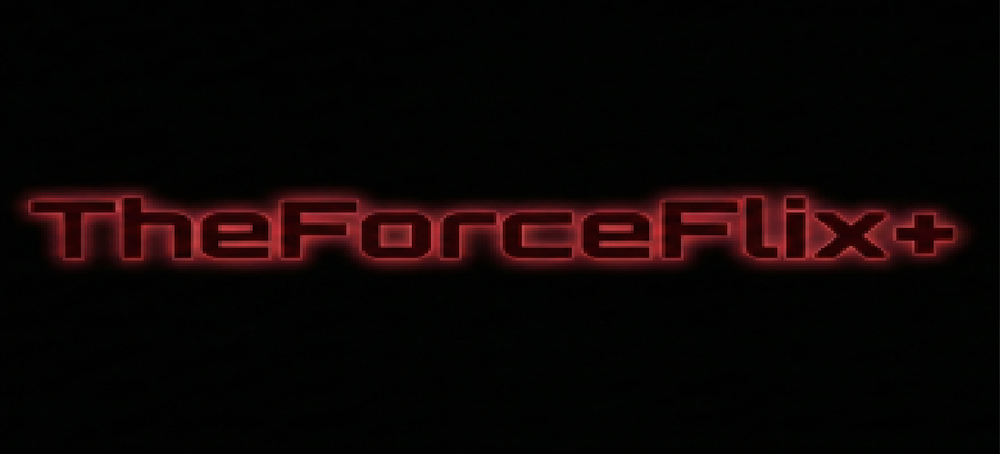

# JediFlix ✨📺⚔️



> "Do lado luminoso do streaming, este APK vem."  
> "Baseado no Kodi, JediFlix é. Modificado com carinho, organizado com sabedoria, agora está."  

Saudações, jovem Padawan. Neste repositório, o APK modificado do seu Kodi reunido está, pronto para ir ao GitHub com mais ordem, estilo e um pouco de energia Jedi 😄

## O que neste templo você encontra 🛸

- `release/jediflixapp-armeabi-v7a-release.apk`: o APK Android pronto para instalar.
- `release/SHA256SUMS.txt`: checksum para conferir se o arquivo íntegro está.
- `docs/INSTALL.md`: como instalar sem tropeçar no sabre de luz.
- `docs/PUBLISH.md`: como subir tudo para um repo no GitHub.
- `docs/GPL-COMPLIANCE.md`: o que observar por ser um projeto derivado do Kodi.
- `metadata/app-info.txt`: metadados principais do app e do build.
- `LICENSE.md`: licença base herdada do projeto Kodi.

## Sobre este projeto, saber você deve 🧠

- Nome do app: `JediFlix`
- Base: `Kodi / XBMC`
- Versão encontrada na árvore atual: `21.9.0`
- Pacote Android atual: `org.xbmc.kodi`

Importante, muito importante: como o pacote atual é `org.xbmc.kodi`, sobrescrever uma instalação oficial do Kodi este APK pode. Backup fazer, prudente é 👀

## Instalar, assim deve você 📲

1. Baixe o arquivo em `release/jediflixapp-armeabi-v7a-release.apk`.
2. Ative a instalação de apps de fontes desconhecidas no Android.
3. Se já tiver o Kodi oficial com o mesmo pacote, avalie desinstalar ou fazer backup antes.
4. Instale o APK e teste com calma, jovem aprendiz.

## Oficial do Team Kodi, isto não é 🚫

Projeto derivado do Kodi, este repositório é. Repositório oficial da XBMC Foundation ou do Team Kodi, não é. Se publicar este APK de forma pública, manter os avisos de licença e oferecer o código-fonte correspondente ou um patch das modificações, necessário é.

Mais detalhes em [docs/GPL-COMPLIANCE.md](docs/GPL-COMPLIANCE.md).

## Para o GitHub, levar isto você pode 🚀

As instruções prontinhas em [docs/PUBLISH.md](docs/PUBLISH.md) deixei eu. Em poucos comandos, para um repo novo subir você consegue.

## Estrutura do repositório 📦

```text
JediFlix-GitHub-Repo/
|-- assets/
|   `-- banner.png
|-- docs/
|   |-- GPL-COMPLIANCE.md
|   |-- INSTALL.md
|   |-- PRIVACY-POLICY.txt
|   `-- PUBLISH.md
|-- metadata/
|   `-- app-info.txt
|-- release/
|   |-- SHA256SUMS.txt
|   `-- jediflixapp-armeabi-v7a-release.apk
|-- scripts/
|   `-- export-source-patch.sh
|-- .gitignore
|-- CHANGELOG.md
|-- LICENSE.md
`-- NOTICE.md
```

## Últimas palavras do Conselho Jedi 🌌

Bonito e organizado, um repo deve ser. Mas completo de verdade ele fica quando, junto do APK, a licença, os avisos e o caminho para o código-fonte também presentes estão.

Que os commits estejam com você. ✨
